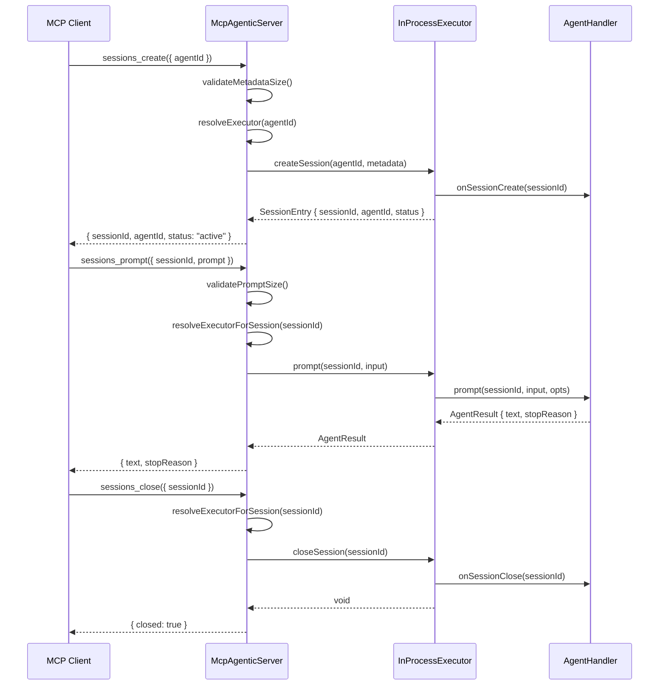
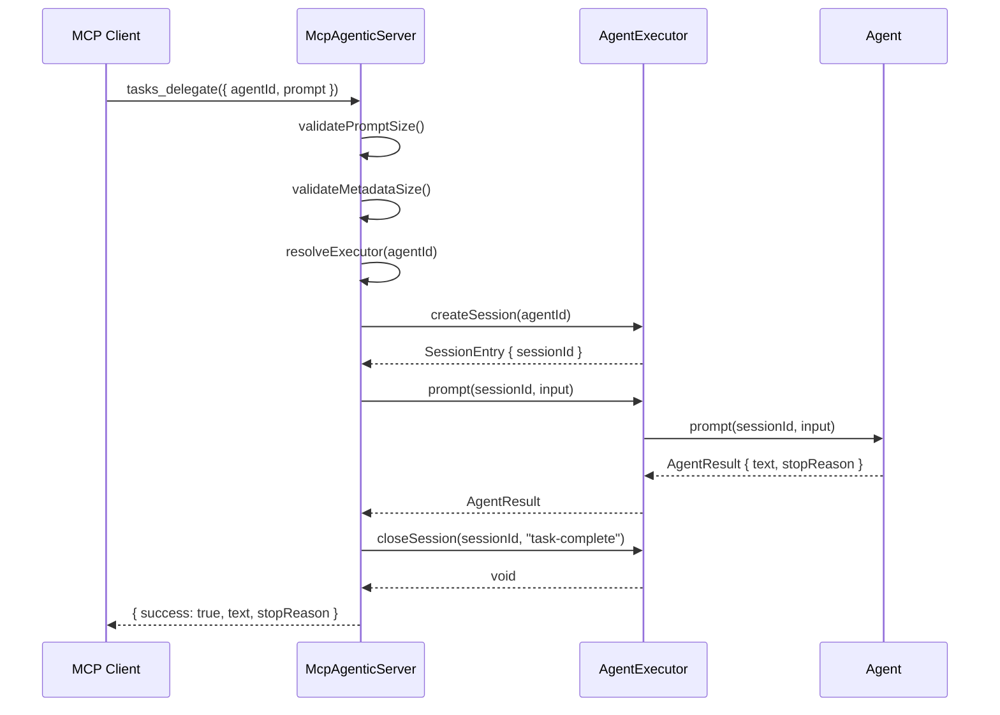
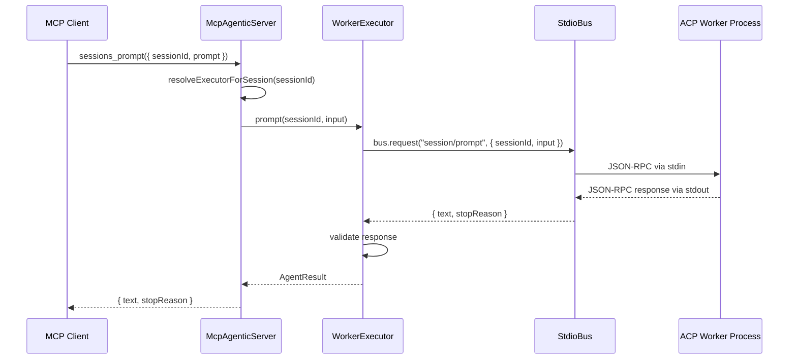
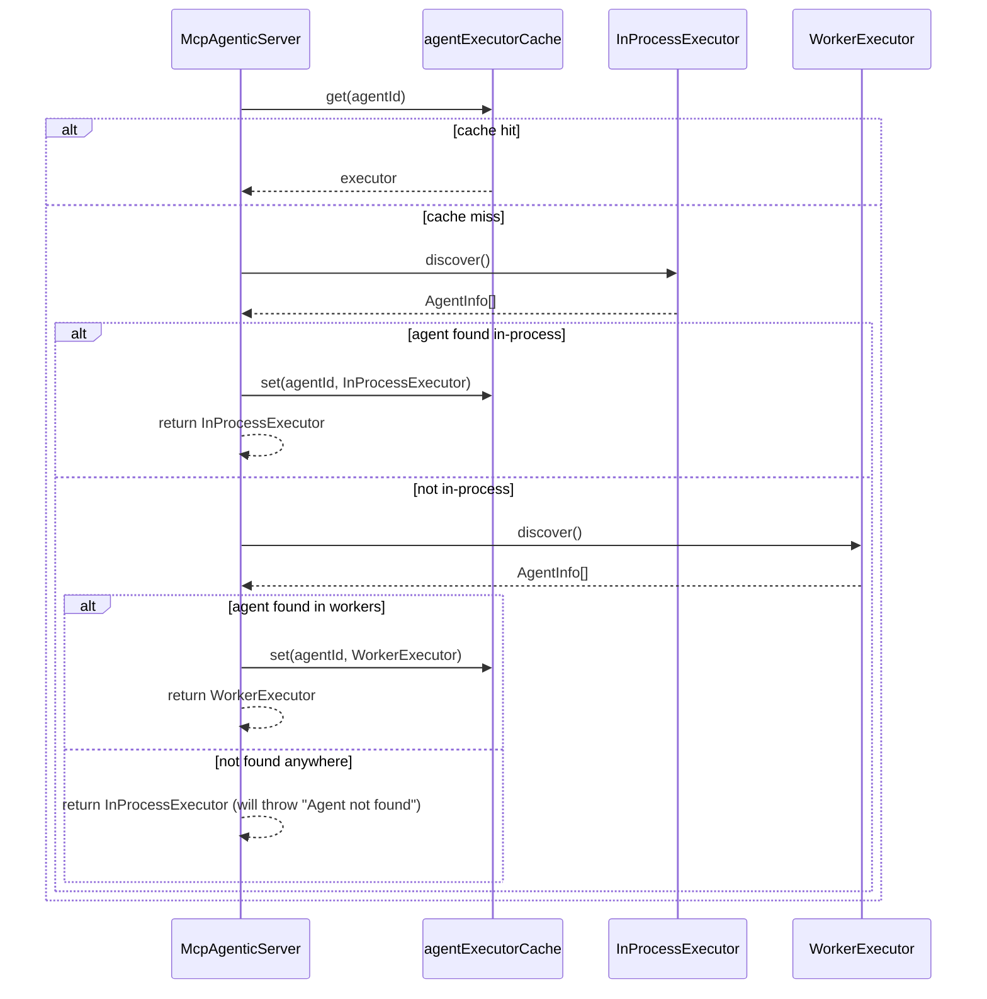

# MCP Agentic — Multi-Agent Orchestration Server

[](https://www.npmjs.com/package/@stdiobus/mcp-agentic)
[](https://modelcontextprotocol.io)
[](https://agentclientprotocol.com)
[](https://github.com/stdiobus)
[](https://nodejs.org)
[](https://esbuild.github.io)
[](https://github.com/stdiobus/mcp-agentic)
[](https://github.com/stdiobus/mcp-agentic/blob/main/LICENSE)
[](https://www.typescriptlang.org)
[](https://github.com/stdiobus/mcp-agentic)

Agent orchestration server that connects MCP clients to ACP-compatible agents through [stdio Bus](https://stdiobus.com).

Agents run in-process (via `AgentHandler`) or as external worker processes (via `@stdiobus/node` StdioBus). The single entry point is `McpAgenticServer`, which owns the MCP server, tool registration, and executor lifecycle.

> **This is a public sandbox for a broader agent infrastructure platform.**
> The repository serves as an open proving ground for experimenting with MCP-accessible ACP agent orchestration, validating protocol integrations, and stress-testing runtime boundaries before selected capabilities are considered for the broader stdio Bus ecosystem.
>
> Contributions, forks, and production experiments are welcome.

## Features

- **In-process agents** — implement `AgentHandler` and register directly
- **Worker agents** — route to external ACP processes via stdio Bus
- **8 MCP tools** — health, discovery, sessions, cancellation, one-shot delegation
- **Session management** — TTL, idle expiry, lifecycle hooks
- **Backpressure** — configurable concurrent request limiting
- **Input validation** — prompt and metadata size limits
- **Typed errors** — `BridgeError` categories with retryability info

## Quick Start

Create a custom entry point that registers your agents before starting the server:

```bash
npm install @stdiobus/mcp-agentic
```

```typescript
import { McpAgenticServer } from '@stdiobus/mcp-agentic';

const server = new McpAgenticServer({ defaultAgentId: 'my-agent' })
  .register({
    id: 'my-agent',
    capabilities: ['code-analysis'],
    async prompt(sessionId, input) {
      return { text: `Analyzed: ${input}`, stopReason: 'end_turn' };
    },
  });

await server.startStdio();
```

This is the primary usage path. Without `register()` calls, no agents are available and delegation tools (`tasks_delegate`, `sessions_create`, etc.) will fail.

## CLI Reference Server

The published binary (`npx @stdiobus/mcp-agentic`) starts a server with **no agents registered**. It is useful for:

- Verifying MCP connectivity (`bridge_health`)
- Inspecting the tool schema (`agents_discover` returns an empty list)
- Confirming the transport layer works end-to-end

It **cannot delegate work** — `tasks_delegate`, `sessions_create`, and `sessions_prompt` will fail because there are no agents to handle requests. For production use, create a custom entry point with `server.register()` calls as shown in Quick Start above.

The `mcp.json` shipped with this package references the CLI binary and is provided as a template. Copy and adapt it to point at your own server script.

## Architecture

### Session lifecycle (in-process agent)



### One-shot delegation (tasks_delegate)



### Worker path (external ACP process)



### Executor resolution (in-process priority)



## MCP Tools

| Tool | Description |
|------|-------------|
| `bridge_health` | Check bridge readiness |
| `agents_discover` | List available agents, optionally filter by capability |
| `sessions_create` | Create a new agent session |
| `sessions_prompt` | Send a prompt to an existing session |
| `sessions_status` | Check session status |
| `sessions_close` | Close a session |
| `sessions_cancel` | Cancel an in-flight prompt |
| `tasks_delegate` | One-shot delegation (create + prompt + close) |

## Configuration

`McpAgenticServer` accepts a `McpAgenticServerConfig`:

```typescript
interface McpAgenticServerConfig {
  agents?: AgentHandler[];
  defaultAgentId?: string;
  maxConcurrentRequests?: number;  // default: 50
  maxPromptBytes?: number;         // default: 1048576 (1 MiB)
  maxMetadataBytes?: number;       // default: 65536 (64 KiB)
}
```

### Worker registration

```typescript
server.registerWorker({
  id: 'py-agent',
  command: 'python',
  args: ['agent.py'],
  env: { API_KEY: process.env.API_KEY },
  capabilities: ['data-analysis'],
});
```

## Public API

Exported from `@stdiobus/mcp-agentic`:

- `McpAgenticServer` — main server class
- `McpAgenticServerConfig` — server configuration type
- `AgentHandler` / `Agent` — agent interface
- `AgentResult`, `AgentEvent`, `AgentChunk`, `AgentFinal`, `AgentError` — result types
- `PromptOpts`, `StreamOpts` — option types
- `WorkerConfig` — worker configuration type

## Development

```bash
npm install
npm run build        # esbuild + tsc declarations
npm run typecheck    # type checking only
npm run test:unit    # unit tests (Jest)
npm run test:e2e     # end-to-end tests
npm run test:all     # unit + e2e
```

## Steering Guides

- [Activation and Scope](steering/activation-and-scope.md)
- [Discovery and Routing](steering/discovery-and-routing.md)
- [Delegation and Session Lifecycle](steering/delegation-and-session-lifecycle.md)
- [Failure Handling](steering/failure-handling.md)
- [Configuration](steering/configuration.md)

## What's Next

MCP Agentic is built to grow. The architecture has no hard limits on the number of tools, agents, or execution backends. Current v1.0 ships with 8 MCP tools and two backends (in-process + worker). Next up: agent registry management, session persistence, operator-level permission controls, and more.

Follow the repo for updates. The project uses semantic versioning.

## License

Apache-2.0
