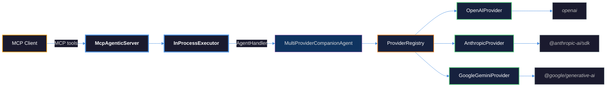
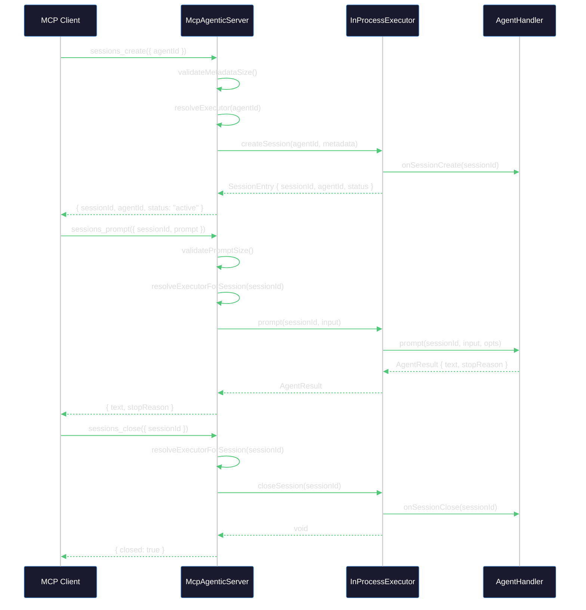
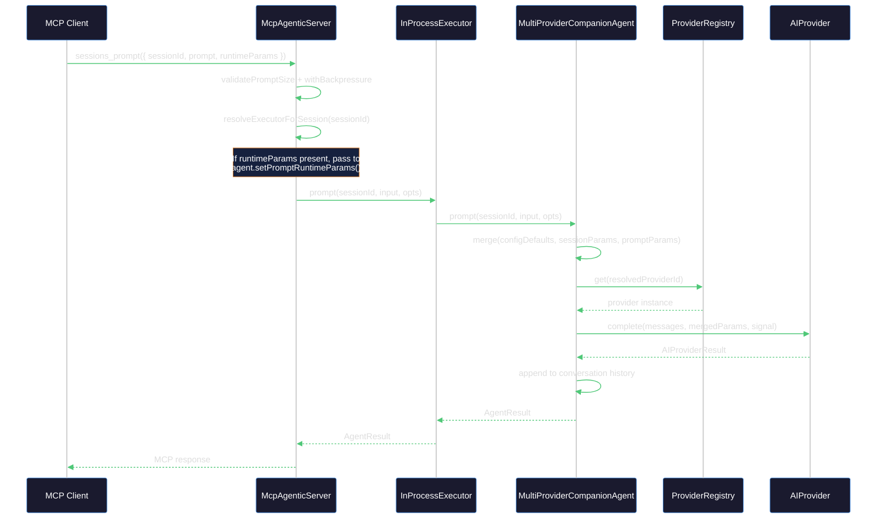
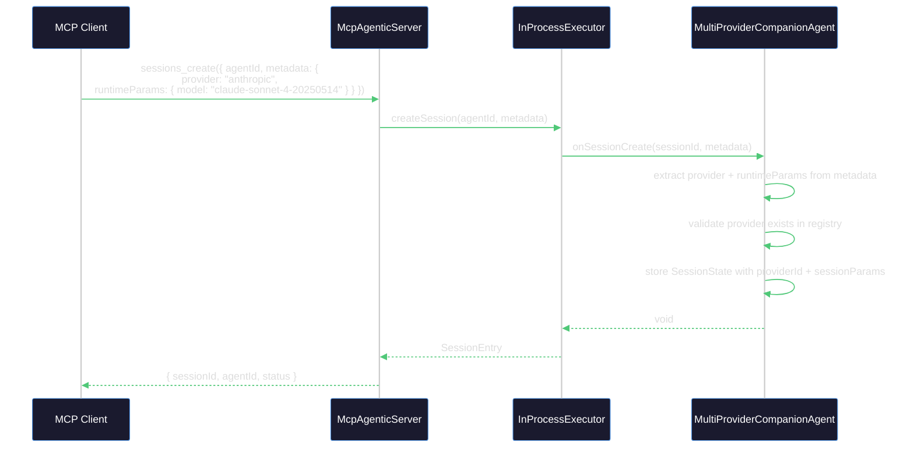
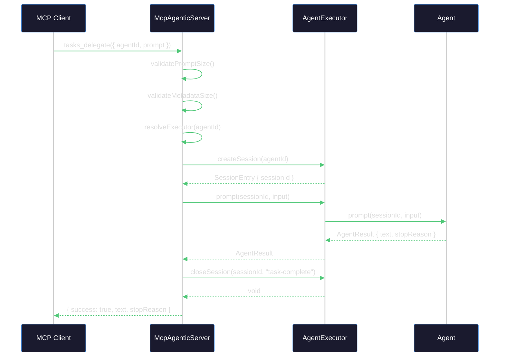
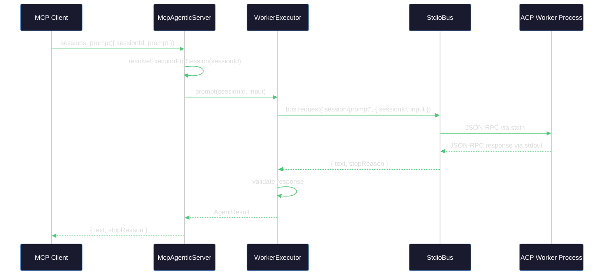
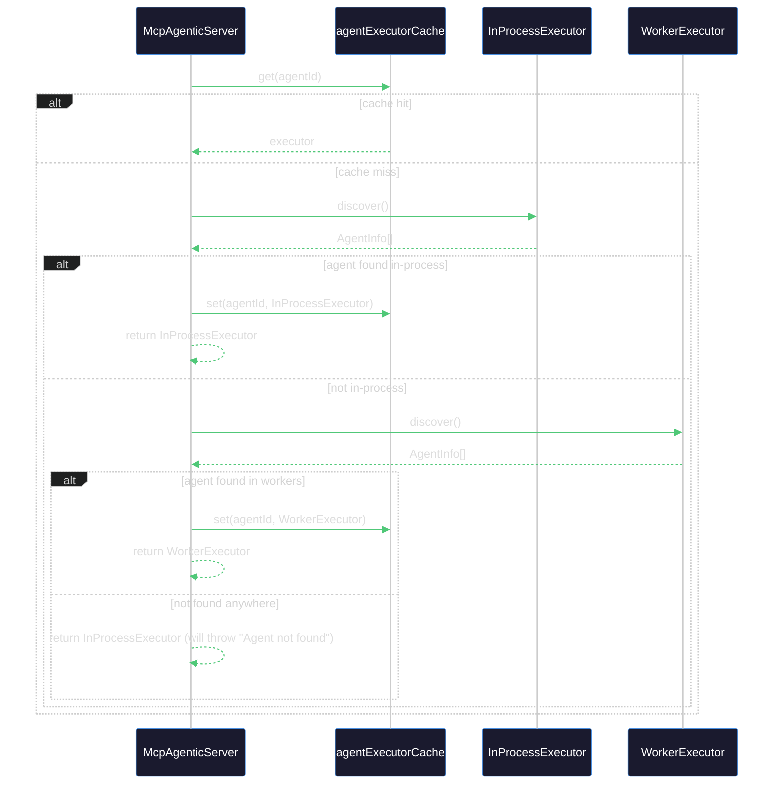

# MCP Agentic — Multi-Agent Orchestration Server

[](https://www.npmjs.com/package/@stdiobus/mcp-agentic)
[](https://modelcontextprotocol.io)
[](https://agentclientprotocol.com)
[](https://github.com/stdiobus)
[](https://nodejs.org)
[](https://esbuild.github.io)
[](https://github.com/stdiobus/mcp-agentic)
[](https://github.com/stdiobus/mcp-agentic/blob/main/LICENSE)
[](https://www.typescriptlang.org)
[](https://github.com/stdiobus/mcp-agentic)

Agent orchestration server that connects MCP clients to ACP-compatible agents through [stdio Bus](https://stdiobus.com).

Agents run in-process (via `AgentHandler`) or as external worker processes (via `@stdiobus/node` StdioBus). The single entry point is `McpAgenticServer`, which owns the MCP server, tool registration, and executor lifecycle.

> **This is a public sandbox for a broader agent infrastructure platform.**
> The repository serves as an open proving ground for experimenting with MCP-accessible ACP agent orchestration, validating protocol integrations, and stress-testing runtime boundaries before selected capabilities are considered for the broader stdio Bus ecosystem.
>
> Contributions, forks, and production experiments are welcome.

## Features

- **In-process agents** — implement `AgentHandler` and register directly
- **Worker agents** — route to external ACP processes via stdio Bus
- **Multi-provider AI** — OpenAI, Anthropic, Google Gemini through native SDKs with a unified `AIProvider` interface
- **Runtime parameter control** — dynamically adjust model, temperature, systemPrompt, and more through MCP tools on every request
- **Provider discovery** — discover available providers and their models via `agents_discover`
- **8 MCP tools** — health, discovery, sessions, cancellation, one-shot delegation
- **Session management** — TTL, idle expiry, lifecycle hooks
- **Backpressure** — configurable concurrent request limiting
- **Input validation** — prompt and metadata size limits
- **Typed errors** — `BridgeError` categories with retryability info

## Basic Quick Start

Create a custom entry point that registers your agents before starting the server:

```bash
npm install @stdiobus/mcp-agentic
```

```typescript
import { McpAgenticServer } from '@stdiobus/mcp-agentic';

const server = new McpAgenticServer({ defaultAgentId: 'my-agent' })
  .register({
    id: 'my-agent',
    capabilities: ['code-analysis'],
    async prompt(sessionId, input) {
      return { text: `Analyzed: ${input}`, stopReason: 'end_turn' };
    },
  });

await server.startStdio();
```

This is the primary usage path. Without `register()` calls, no agents are available and delegation tools (`tasks_delegate`, `sessions_create`, etc.) will fail.

## Multi-Provider Quick Start

Use `MultiProviderCompanionAgent` to serve multiple AI providers through a single MCP server. Install the provider SDKs you need:

```bash
npm install @stdiobus/mcp-agentic
npm install openai @anthropic-ai/sdk @google/generative-ai
```

```typescript
import { McpAgenticServer, ProviderRegistry, OpenAIProvider, AnthropicProvider, GoogleGeminiProvider, MultiProviderCompanionAgent } from '@stdiobus/mcp-agentic';

// 1. Create providers with credentials from environment variables
const registry = new ProviderRegistry();

registry.register(new OpenAIProvider({
  credentials: { apiKey: process.env.OPENAI_API_KEY! },
  models: ['gpt-4o', 'gpt-4o-mini'],
}));

registry.register(new AnthropicProvider({
  credentials: { apiKey: process.env.ANTHROPIC_API_KEY! },
  models: ['claude-sonnet-4-20250514'],
}));

registry.register(new GoogleGeminiProvider({
  credentials: { apiKey: process.env.GOOGLE_AI_API_KEY! },
  models: ['gemini-2.0-flash'],
}));

// 2. Create a multi-provider agent
const agent = new MultiProviderCompanionAgent({
  id: 'multi-ai',
  defaultProviderId: 'openai',
  registry,
  systemPrompt: 'You are a helpful assistant.',
});

// 3. Register and start
const server = new McpAgenticServer({ defaultAgentId: 'multi-ai' })
  .register(agent);

await server.startStdio();
```

MCP clients can then select a provider per session and override parameters per prompt:

```jsonc
// Create a session with Anthropic
{ "tool": "sessions_create", "arguments": { "agentId": "multi-ai", "metadata": { "provider": "anthropic", "runtimeParams": { "model": "claude-sonnet-4-20250514" } } } }

// Send a prompt with runtime parameter overrides
{ "tool": "sessions_prompt", "arguments": { "sessionId": "...", "prompt": "Explain MCP", "runtimeParams": { "temperature": 0.3, "maxTokens": 200 } } }

// One-shot delegation with a specific provider
{ "tool": "tasks_delegate", "arguments": { "prompt": "Summarize this", "metadata": { "provider": "google-gemini" }, "runtimeParams": { "temperature": 0 } } }
```

## CLI Reference Server

The published binary (`npx @stdiobus/mcp-agentic`) starts a server with **no agents registered**. It is useful for:

- Verifying MCP connectivity (`bridge_health`)
- Inspecting the tool schema (`agents_discover` returns an empty list)
- Confirming the transport layer works end-to-end

It **cannot delegate work** — `tasks_delegate`, `sessions_create`, and `sessions_prompt` will fail because there are no agents to handle requests. For production use, create a custom entry point with `server.register()` calls as shown in Quick Start above.

The `mcp.json` shipped with this package references the CLI binary and is provided as a template. Copy and adapt it to point at your own server script.

## Architecture



<details>
<summary>Session lifecycle — create → prompt → close (in-process agent)</summary>



</details>

<details>
<summary>sessions_prompt with runtimeParams — parameter merge and provider delegation</summary>



</details>

<details>
<summary>sessions_create with provider selection — binding a session to a specific AI provider</summary>



</details>

<details>
<summary>One-shot delegation — tasks_delegate flow</summary>



</details>

<details>
<summary>Worker path — external ACP process via StdioBus</summary>



</details>

<details>
<summary>Executor resolution — in-process priority and caching</summary>



</details>

## MCP Tools

| Tool | Description | Notes |
|------|-------------|-------|
| `bridge_health` | Check bridge readiness | |
| `agents_discover` | List available agents, optionally filter by capability | Response includes `providers` field with provider IDs and models when the agent supports multiple providers |
| `sessions_create` | Create a new agent session | Pass `metadata.provider` to select a provider; pass `metadata.runtimeParams` for session-level defaults |
| `sessions_prompt` | Send a prompt to an existing session | Accepts optional `runtimeParams` for per-prompt overrides (model, temperature, systemPrompt, etc.) |
| `sessions_status` | Check session status | |
| `sessions_close` | Close a session | |
| `sessions_cancel` | Cancel an in-flight prompt | |
| `tasks_delegate` | One-shot delegation (create + prompt + close) | Accepts optional `runtimeParams` for parameter overrides; pass `metadata.provider` to select a provider |

## Configuration

`McpAgenticServer` accepts a `McpAgenticServerConfig`:

```typescript
interface McpAgenticServerConfig {
  agents?: AgentHandler[];
  defaultAgentId?: string;
  maxConcurrentRequests?: number;  // default: 50
  maxPromptBytes?: number;         // default: 1048576 (1 MiB)
  maxMetadataBytes?: number;       // default: 65536 (64 KiB)
}
```

### Worker registration

```typescript
server.registerWorker({
  id: 'py-agent',
  command: 'python',
  args: ['agent.py'],
  env: { API_KEY: process.env.API_KEY },
  capabilities: ['data-analysis'],
});
```

### Provider configuration

Each provider is constructed with a `ProviderConfig`:

```typescript
interface ProviderConfig {
  /** Credential key-value pairs sourced from environment variables. */
  credentials: Record<string, string>;
  /** Model identifiers available for this provider. */
  models: string[];
  /** Default RuntimeParams applied when no override is specified. */
  defaults?: RuntimeParams;
}
```

Example:

```typescript
import { OpenAIProvider, AnthropicProvider } from '@stdiobus/mcp-agentic';

const openai = new OpenAIProvider({
  credentials: { apiKey: process.env.OPENAI_API_KEY! },
  models: ['gpt-4o', 'gpt-4o-mini'],
  defaults: { temperature: 0.7, maxTokens: 4096 },
});

const anthropic = new AnthropicProvider({
  credentials: { apiKey: process.env.ANTHROPIC_API_KEY! },
  models: ['claude-sonnet-4-20250514'],
  defaults: { temperature: 0.5 },
});
```

### RuntimeParams

`RuntimeParams` controls AI generation behavior and can be specified at three levels with ascending priority:

```
ProviderConfig.defaults  <  session metadata.runtimeParams  <  prompt-level runtimeParams
```

Only defined fields override lower-priority values. `undefined` fields are ignored during merge. `providerSpecific` is shallow-merged across all layers.

```typescript
interface RuntimeParams {
  model?: string;              // Model identifier
  temperature?: number;        // Sampling temperature (0–2)
  maxTokens?: number;          // Maximum tokens to generate
  topP?: number;               // Nucleus sampling (0–1)
  topK?: number;               // Top-K sampling
  stopSequences?: string[];    // Stop sequences
  systemPrompt?: string;       // System prompt override
  providerSpecific?: Record<string, unknown>;  // Provider-native parameters
}
```

## Public API

Exported from `@stdiobus/mcp-agentic`:

**Core types:**

- `McpAgenticServer` — main server class
- `McpAgenticServerConfig` — server configuration type
- `AgentHandler` / `Agent` — agent interface
- `AgentResult`, `AgentEvent`, `AgentChunk`, `AgentFinal`, `AgentError` — result types
- `PromptOpts`, `StreamOpts` — option types
- `WorkerConfig` — worker configuration type

**Provider Layer:**

- `AIProvider` — unified provider interface
- `AIProviderResult` — normalized provider response type
- `RuntimeParams` — generation parameter type
- `ProviderConfig` — provider configuration type
- `ChatMessage` — standard message format type
- `ProviderRegistry` — provider registry class
- `ProviderInfo` — provider info type (id + models)
- `mergeRuntimeParams` — three-level parameter merge utility
- `OpenAIProvider` — OpenAI provider via native SDK
- `AnthropicProvider` — Anthropic provider via native SDK
- `GoogleGeminiProvider` — Google Gemini provider via native SDK

**Multi-Provider Agent:**

- `MultiProviderCompanionAgent` — agent supporting multiple AI providers
- `MultiProviderCompanionConfig` — multi-provider agent configuration type

## Development

```bash
npm install
npm run build        # esbuild + tsc declarations
npm run typecheck    # type checking only
npm run test:unit    # unit tests (Jest)
npm run test:e2e     # end-to-end tests
npm run test:all     # unit + e2e
npm run test:e2e:providers  # live provider e2e tests (requires API keys)
```

### Peer dependencies for provider development

The provider SDKs are peer/optional dependencies. Install only the ones you need:

```bash
npm install openai                  # OpenAI provider
npm install @anthropic-ai/sdk       # Anthropic provider
npm install @google/generative-ai   # Google Gemini provider
```

### Live provider e2e tests

The `test:e2e:providers` script runs end-to-end tests against real AI provider APIs. Tests are skipped automatically when the corresponding API key is not set:

| Environment Variable | Provider |
|---------------------|----------|
| `OPENAI_API_KEY` | OpenAI |
| `ANTHROPIC_API_KEY` | Anthropic |
| `GOOGLE_AI_API_KEY` | Google Gemini |

## Steering Guides

- [Activation and Scope](steering/activation-and-scope.md)
- [Discovery and Routing](steering/discovery-and-routing.md)
- [Delegation and Session Lifecycle](steering/delegation-and-session-lifecycle.md)
- [Failure Handling](steering/failure-handling.md)
- [Configuration](steering/configuration.md)

## What's Next

MCP Agentic is built to grow. The architecture has no hard limits on the number of tools, agents, or execution backends. Current v1.0 ships with 8 MCP tools and two backends (in-process + worker). Next up: agent registry management, session persistence, operator-level permission controls, and more.

Follow the repo for updates. The project uses semantic versioning.

## License

Apache-2.0
