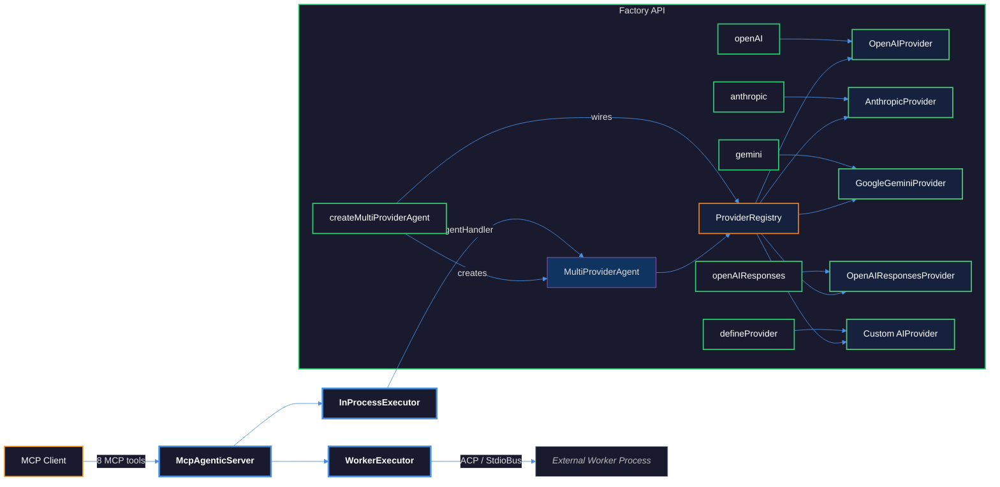
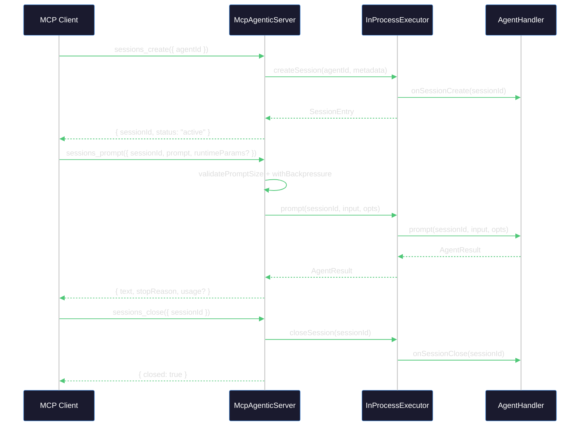
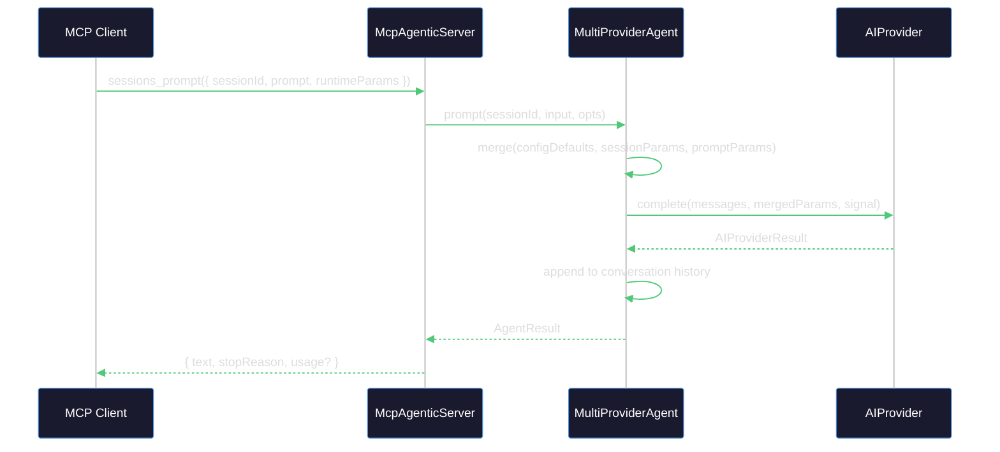
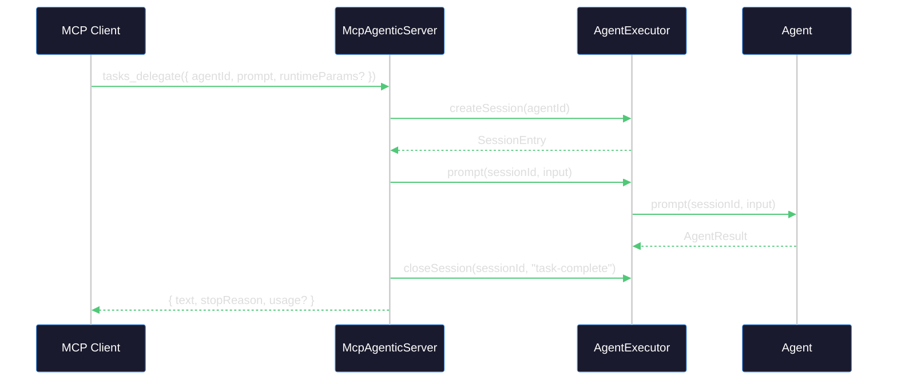
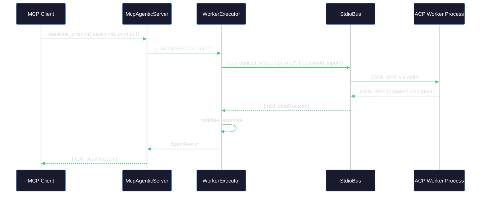

<h1 align="center">MCP Agentic — Multi-Agent Orchestration Server</h1>

<p align="center">
  Agent orchestration server that connects MCP clients to ACP-compatible agents through <a href="https://stdiobus.com">stdio Bus</a>.<br/>
  In-process agents, external workers, multi-provider AI — all through 8 MCP tools.
</p>

<p align="center">
  <a href="https://www.npmjs.com/package/@stdiobus/mcp-agentic"></a>
  <a href="https://modelcontextprotocol.io"></a>
  <a href="https://agentclientprotocol.com"></a>
  <a href="https://github.com/stdiobus"></a>
  <a href="https://nodejs.org"></a>
  <a href="https://esbuild.github.io"></a>
  <a href="https://github.com/stdiobus/mcp-agentic"></a>
  <a href="https://github.com/stdiobus/mcp-agentic/blob/main/LICENSE"></a>
  <a href="https://www.typescriptlang.org"></a>
  <a href="https://github.com/stdiobus/mcp-agentic"></a>
  <a href="https://github.com/stdiobus/mcp-agentic"></a>
</p>

---

## What it does

`@stdiobus/mcp-agentic` exposes a set of **MCP tools** that let any MCP-compatible client (Kiro, Claude Desktop, Cursor, custom agents) delegate work to AI agents — in-process or external.

You implement an agent, register it, start the server. Your MCP client calls `tasks_delegate` or `sessions_prompt`. The server routes the request to the right agent, returns the result. That's the loop.

The multi-provider layer lets you serve OpenAI, Anthropic, and Gemini through a single server with per-session and per-prompt model switching, runtime parameter overrides, multimodal content, and the OpenAI Responses API.

> **Sandbox note:** This repository is an open proving ground for MCP/ACP agent orchestration. The architecture validates protocol integrations and runtime boundaries before capabilities move into the broader stdio Bus ecosystem. Production use, contributions, and forks are all welcome.

---

## Install

```bash
npm install @stdiobus/mcp-agentic
```

Install only the provider SDKs you actually need:

```bash
npm install openai                  # OpenAI Chat Completions + Responses API
npm install @anthropic-ai/sdk       # Anthropic Claude
npm install @google/generative-ai   # Google Gemini
```

---

## Quick start: custom agent

The minimal path — implement `AgentHandler`, register it, start the server:

```typescript
import { McpAgenticServer } from '@stdiobus/mcp-agentic';

const server = new McpAgenticServer({ defaultAgentId: 'my-agent' })
  .register({
    id: 'my-agent',
    capabilities: ['code-analysis'],
    async prompt(sessionId, input) {
      return { text: `Analyzed: ${input}`, stopReason: 'end_turn' };
    },
  });

await server.start();
```

Without `register()` calls the server starts but no agents are available — `tasks_delegate` and `sessions_*` tools will fail. The CLI binary (`npx @stdiobus/mcp-agentic`) demonstrates this: useful for verifying transport, not for delegating work.

---

## Quick start: multi-provider AI

Connect OpenAI, Anthropic, and Gemini to a single server. MCP clients switch providers per session, override model and parameters per prompt:

```typescript
import {
  McpAgenticServer,
  openAI,
  anthropic,
  gemini,
  createMultiProviderAgent,
} from '@stdiobus/mcp-agentic';

// 1. Create providers with flat, typed options
const agent = createMultiProviderAgent({
  id: 'multi-ai',
  defaultProviderId: 'openai',
  systemPrompt: 'You are a helpful assistant.',
  providers: [
    openAI({
      apiKey: process.env.OPENAI_API_KEY!,
      models: ['gpt-4o', 'gpt-4o-mini'],
    }),
    anthropic({
      apiKey: process.env.ANTHROPIC_API_KEY!,
      models: ['claude-sonnet-4-20250514'],
    }),
    gemini({
      apiKey: process.env.GOOGLE_AI_API_KEY!,
      models: ['gemini-2.0-flash'],
    }),
  ],
});

// 2. Register and start
const server = new McpAgenticServer({ defaultAgentId: 'multi-ai' })
  .register(agent);

await server.start();
```

MCP tool calls from that point:

```jsonc
// Pick a provider when creating the session
{ "tool": "sessions_create", "arguments": { "agentId": "multi-ai", "metadata": { "provider": "anthropic", "runtimeParams": { "model": "claude-sonnet-4-20250514" } } } }

// Override parameters per prompt
{ "tool": "sessions_prompt", "arguments": { "sessionId": "...", "prompt": "Explain MCP", "runtimeParams": { "temperature": 0.3, "maxTokens": 500 } } }

// One-shot with a specific provider
{ "tool": "tasks_delegate", "arguments": { "prompt": "Summarize this", "metadata": { "provider": "google-gemini" }, "runtimeParams": { "temperature": 0 } } }
```

---

## Multimodal content

`ChatMessage.content` accepts `string | ContentPart[]`. All three built-in providers map content parts to their native SDK shapes.

```typescript
import type { ChatMessage, ContentPart } from '@stdiobus/mcp-agentic';

// Text + image in one message
const message: ChatMessage = {
  role: 'user',
  content: [
    { type: 'text', text: 'Describe this diagram' },
    { type: 'image_url', image_url: { url: 'https://example.com/diagram.png' }, detail: 'high' },
  ],
};

// File reference (by server-side file_id from Files API)
const fileMessage: ChatMessage = {
  role: 'user',
  content: [
    { type: 'text', text: 'Summarize this document' },
    { type: 'file', file: { file_id: 'file-abc123' } },
  ],
};
```

Content part types:

| Type | Fields | Notes |
|------|--------|-------|
| `text` | `text: string` | Plain text part |
| `image_url` | `image_url.url`, optional `detail` | `detail`: `low` \| `high` \| `original` \| `auto` |
| `file` | `file.file_id` or `file.filename` or `file.file_data` | `file_data` is base64-encoded |

---

## OpenAI Responses API

`OpenAIResponsesProvider` targets the OpenAI `/v1/responses` endpoint exclusively — it never calls `/v1/chat/completions`. Use it when you need native Responses API features (input files, structured output, stateful sessions):

```typescript
import {
  McpAgenticServer,
  openAIResponses,
  createMultiProviderAgent,
} from '@stdiobus/mcp-agentic';

const agent = createMultiProviderAgent({
  id: 'responses-agent',
  defaultProviderId: 'openai-responses',
  providers: [
    openAIResponses({
      apiKey: process.env.OPENAI_API_KEY!,
      models: ['gpt-4o', 'o4-mini'],
    }),
  ],
});

const server = new McpAgenticServer({ defaultAgentId: 'responses-agent' })
  .register(agent);

await server.start();
```

Use alongside the Files API to upload a file and reference it in a prompt:

```typescript
import { OpenAIResponsesProvider, openAIResponses } from '@stdiobus/mcp-agentic';

const provider = openAIResponses({ apiKey: process.env.OPENAI_API_KEY!, models: ['gpt-4o'] });

// Upload a file
const uploaded = await provider.files.create({
  filename: 'report.pdf',
  file_data: base64Content,
  mime_type: 'application/pdf',
});

// Reference it in a multimodal message
const message = {
  role: 'user' as const,
  content: [
    { type: 'text' as const, text: 'Summarize this report' },
    { type: 'file' as const, file: { file_id: uploaded.id } },
  ],
};
```

---

## Custom providers with `defineProvider`

Create a provider for any LLM endpoint with Zod-validated options and discoverable metadata:

```typescript
import { z } from 'zod';
import { defineProvider, createMultiProviderAgent, openAI } from '@stdiobus/mcp-agentic';

const myLLM = defineProvider({
  id: 'my-llm',
  kind: 'llm',
  displayName: 'My Custom LLM',
  description: 'Internal LLM service',
  capabilities: { streaming: false, tools: false, vision: false, jsonMode: true },
  schema: z.object({
    endpoint: z.string().url(),
    apiKey: z.string().min(1),
    models: z.array(z.string()).nonempty(),
  }),
  create: (options) => ({
    id: 'my-llm',
    models: options.models,
    async complete(messages, params) {
      const res = await fetch(options.endpoint, {
        method: 'POST',
        headers: { Authorization: `Bearer ${options.apiKey}`, 'Content-Type': 'application/json' },
        body: JSON.stringify({ messages, ...params }),
      });
      const data = await res.json();
      return { text: data.text, stopReason: 'end_turn' as const };
    },
  }),
});

// Use alongside built-in factories
const agent = createMultiProviderAgent({
  id: 'hybrid',
  defaultProviderId: 'openai',
  providers: [
    openAI({ apiKey: process.env.OPENAI_API_KEY!, models: ['gpt-4o'] }),
    myLLM({ endpoint: 'https://my-llm.internal/v1/chat', apiKey: 'sk-...', models: ['my-model'] }),
  ],
});
```

Static metadata is available for introspection and JSON Schema generation:

```typescript
myLLM.id           // 'my-llm'
myLLM.kind         // 'llm'
myLLM.displayName  // 'My Custom LLM'
myLLM.capabilities // { streaming: false, tools: false, vision: false, jsonMode: true }
myLLM.schema       // Zod schema
```

`agents_discover` automatically surfaces `displayName`, `description`, `kind`, and `capabilities` for custom providers.

---

## External worker agents

Route to ACP-compatible processes (Python, Go, any language) via stdio Bus:

```typescript
server.registerWorker({
  id: 'py-agent',
  command: 'python',
  args: ['agent.py'],
  env: { API_KEY: process.env.API_KEY },
  capabilities: ['data-analysis'],
  // Optional transport overrides
  workerTcpHost: '127.0.0.1',
  workerTcpPort: 9000,
});
```

In-process agents always take priority when an agent ID exists in both executors.

---

## MCP tools reference

| Tool | Description |
|------|-------------|
| `bridge_health` | Check bridge readiness |
| `agents_discover` | List agents; optionally filter by capability. Returns enriched `providers` field with `id`, `models`, `kind`, `capabilities`, `displayName`, `description` |
| `sessions_create` | Create a session. Pass `metadata.provider` to bind a provider; `metadata.runtimeParams` for session-level defaults |
| `sessions_prompt` | Send a prompt. Accepts `runtimeParams` for per-prompt overrides (model, temperature, systemPrompt, maxTokens, etc.) |
| `sessions_status` | Check session status |
| `sessions_close` | Close a session |
| `sessions_cancel` | Cancel an in-flight prompt |
| `tasks_delegate` | One-shot: create + prompt + close in a single call |

### `agents_discover` response shape

```json
{
  "agents": [{
    "id": "multi-ai",
    "capabilities": ["chat"],
    "status": "ready",
    "providers": [
      {
        "id": "openai",
        "models": ["gpt-4o"],
        "kind": "llm",
        "capabilities": { "streaming": true, "tools": true, "vision": true, "jsonMode": true },
        "displayName": "OpenAI",
        "description": "OpenAI GPT models via official openai npm SDK"
      }
    ]
  }]
}
```

---

## Runtime parameters

Three-level merge, ascending priority:

```
ProviderConfig.defaults  →  session metadata.runtimeParams  →  prompt-level runtimeParams
```

Only defined fields override lower-priority values. `providerSpecific` is shallow-merged across all layers.

```typescript
interface RuntimeParams {
  model?: string;
  temperature?: number;       // 0–2
  maxTokens?: number;
  topP?: number;              // 0–1
  topK?: number;
  stopSequences?: string[];
  systemPrompt?: string;
  detail?: 'low' | 'high' | 'original' | 'auto';   // image resolution hint
  providerSpecific?: Record<string, unknown>;
}
```

---

## Server configuration

```typescript
interface McpAgenticServerConfig {
  agents?: AgentHandler[];          // Register agents at construction time
  defaultAgentId?: string;          // Default agent when none specified
  maxConcurrentRequests?: number;   // Default: 50
  maxPromptBytes?: number;          // Default: 1 MiB (1048576)
  maxMetadataBytes?: number;        // Default: 64 KiB (65536)
}
```

---

## Architecture


```mermaid
%%{init: {'theme':'dark', 'themeVariables':{'edgeLabelBackground':'#1a1a2e','lineColor':'#4a90e2','textColor':'#ddd'}}}%%
graph LR
    C[MCP Client] -->|8 MCP tools| S[McpAgenticServer]
    S --> IPE[InProcessExecutor]
    S --> WE[WorkerExecutor]

    IPE -->|AgentHandler| MCA[MultiProviderAgent]
    WE -->|ACP / StdioBus| EXT[External Worker Process]

    subgraph FAC ["Factory API"]
        openAI --> OP[OpenAIProvider]
        anthropic --> AP[AnthropicProvider]
        gemini --> GP[GoogleGeminiProvider]
        openAIResponses --> RP[OpenAIResponsesProvider]
        defineProvider --> CP[Custom AIProvider]
        createMultiProviderAgent -->|wires| PR[ProviderRegistry]
        createMultiProviderAgent -->|creates| MCA
    end

    MCA --> PR
    PR --> OP & AP & GP & RP & CP

    classDef client fill:#1a1a2e,stroke:#f39c12,stroke-width:2px,color:#fff
    classDef kernel fill:#1a1a2e,stroke:#4a90e2,stroke-width:3px,color:#fff,font-weight:bold
    classDef agent fill:#0f3460,stroke:#9b59b6,stroke-width:1px,color:#ddd
    classDef proxy fill:#16213e,stroke:#e67e22,stroke-width:2px,color:#fff
    classDef provider fill:#16213e,stroke:#50c878,stroke-width:2px,color:#fff
    classDef factory fill:#1a1a2e,stroke:#2ecc71,stroke-width:2px,color:#fff
    classDef external fill:#1a1a2e,stroke:#95a5a6,stroke-width:1px,color:#bbb,font-style:italic

    class C client
    class S,IPE,WE kernel
    class MCA agent
    class PR proxy
    class OP,AP,GP,RP,CP provider
    class openAI,anthropic,gemini,openAIResponses,defineProvider,createMultiProviderAgent factory
    class EXT external

    style FAC fill:#1a1a2e,stroke:#2ecc71,stroke-width:2px,color:#ddd
```

<details>
<summary>Session lifecycle — create → prompt → close</summary>


```mermaid
%%{init: {'theme':'dark', 'themeVariables':{'actorBkg':'#1a1a2e','actorBorder':'#4a90e2','actorTextColor':'#fff','signalColor':'#50c878','signalTextColor':'#ddd','noteBkgColor':'#16213e','noteTextColor':'#fff','noteBorderColor':'#e67e22','activationBkgColor':'#0f3460','activationBorderColor':'#9b59b6'}}}%%
sequenceDiagram
    participant C as MCP Client
    participant S as McpAgenticServer
    participant E as InProcessExecutor
    participant A as AgentHandler

    C->>S: sessions_create({ agentId })
    S->>E: createSession(agentId, metadata)
    E->>A: onSessionCreate(sessionId)
    E-->>S: SessionEntry
    S-->>C: { sessionId, status: "active" }

    C->>S: sessions_prompt({ sessionId, prompt, runtimeParams? })
    S->>S: validatePromptSize + withBackpressure
    S->>E: prompt(sessionId, input, opts)
    E->>A: prompt(sessionId, input, opts)
    A-->>E: AgentResult
    E-->>S: AgentResult
    S-->>C: { text, stopReason, usage? }

    C->>S: sessions_close({ sessionId })
    S->>E: closeSession(sessionId)
    E->>A: onSessionClose(sessionId)
    S-->>C: { closed: true }
```

</details>

<details>
<summary>RuntimeParams merge — provider → session → prompt</summary>


```mermaid
%%{init: {'theme':'dark', 'themeVariables':{'actorBkg':'#1a1a2e','actorBorder':'#4a90e2','actorTextColor':'#fff','signalColor':'#50c878','signalTextColor':'#ddd','noteBkgColor':'#16213e','noteTextColor':'#fff','noteBorderColor':'#e67e22','activationBkgColor':'#0f3460','activationBorderColor':'#9b59b6'}}}%%
sequenceDiagram
    participant Client as MCP Client
    participant Server as McpAgenticServer
    participant Agent as MultiProviderAgent
    participant Provider as AIProvider

    Client->>Server: sessions_prompt({ sessionId, prompt, runtimeParams })
    Server->>Agent: prompt(sessionId, input, opts)
    Agent->>Agent: merge(configDefaults, sessionParams, promptParams)
    Agent->>Provider: complete(messages, mergedParams, signal)
    Provider-->>Agent: AIProviderResult
    Agent->>Agent: append to conversation history
    Agent-->>Server: AgentResult
    Server-->>Client: { text, stopReason, usage? }
```

</details>

<details>
<summary>One-shot delegation — tasks_delegate</summary>


```mermaid
%%{init: {'theme':'dark', 'themeVariables':{'actorBkg':'#1a1a2e','actorBorder':'#4a90e2','actorTextColor':'#fff','signalColor':'#50c878','signalTextColor':'#ddd','noteBkgColor':'#16213e','noteTextColor':'#fff','noteBorderColor':'#e67e22','activationBkgColor':'#0f3460','activationBorderColor':'#9b59b6'}}}%%
sequenceDiagram
    participant C as MCP Client
    participant S as McpAgenticServer
    participant E as AgentExecutor
    participant A as Agent

    C->>S: tasks_delegate({ agentId, prompt, runtimeParams? })
    S->>E: createSession(agentId)
    E-->>S: SessionEntry
    S->>E: prompt(sessionId, input)
    E->>A: prompt(sessionId, input)
    A-->>E: AgentResult
    S->>E: closeSession(sessionId, "task-complete")
    S-->>C: { text, stopReason, usage? }
```

</details>

<details>
<summary>Worker path — external ACP process via StdioBus</summary>


```mermaid
%%{init: {'theme':'dark', 'themeVariables':{'actorBkg':'#1a1a2e','actorBorder':'#4a90e2','actorTextColor':'#fff','signalColor':'#50c878','signalTextColor':'#ddd','noteBkgColor':'#16213e','noteTextColor':'#fff','noteBorderColor':'#e67e22','activationBkgColor':'#0f3460','activationBorderColor':'#9b59b6'}}}%%
sequenceDiagram
    participant C as MCP Client
    participant S as McpAgenticServer
    participant W as WorkerExecutor
    participant B as StdioBus
    participant P as ACP Worker Process

    C->>S: sessions_prompt({ sessionId, prompt })
    S->>W: prompt(sessionId, input)
    W->>B: bus.request("session/prompt", { sessionId, input })
    B->>P: JSON-RPC via stdin
    P-->>B: JSON-RPC response via stdout
    B-->>W: { text, stopReason }
    W->>W: validate response
    W-->>S: AgentResult
    S-->>C: { text, stopReason }
```

</details>

---

## Using MCP Agentic in agentic cloud workflows

MCP Agentic is designed to be the local delegation layer in multi-agent systems. A typical pattern for agentic cloud work:

**1. Kiro + companion agent (in-process)**

Run a multi-provider companion locally. Kiro routes tasks to it through MCP, switching providers per task type:

```json
{
  "mcpServers": {
    "companion": {
      "command": "npx",
      "args": ["tsx", "examples/multi-provider-companion/multi-provider-companion.ts"],
      "env": {
        "OPENAI_API_KEY": "sk-...",
        "ANTHROPIC_API_KEY": "sk-ant-...",
        "GOOGLE_AI_API_KEY": "AIza..."
      }
    }
  }
}
```

The companion is ready for `agents_discover` → `sessions_create` → `sessions_prompt` from any MCP client. Provider selection, model switching, and runtime parameter overrides work through MCP tool calls — no code changes needed.

**2. Specialized agents per domain**

Register multiple agents on the same server, each with its own capabilities. MCP clients filter by capability at discovery time:

```typescript
const server = new McpAgenticServer()
  .register({ id: 'reviewer', capabilities: ['code-review'], async prompt(s, i) { /* ... */ } })
  .register({ id: 'architect', capabilities: ['architecture'], async prompt(s, i) { /* ... */ } })
  .registerWorker({ id: 'data-pipeline', command: 'python', args: ['pipeline.py'], capabilities: ['etl'] });

await server.start();
```

```
agents_discover({ capability: "code-review" }) → [{ id: "reviewer", ... }]
```

**3. Multi-model analysis pipelines**

Use session continuity and provider switching to run the same problem through multiple models, accumulating context:

```
sessions_create({ agentId: "multi-ai", metadata: { provider: "openai" } })
sessions_prompt({ sessionId: "s1", prompt: "Analyze this architecture for risks" })
// Switch to Anthropic for a second opinion in the same conversation context
sessions_prompt({ sessionId: "s1", prompt: "Now critique that analysis from a security perspective", runtimeParams: { model: "claude-sonnet-4-20250514" } })
```

**4. File analysis with the Responses API**

Upload files once, reference by ID across prompts. Useful for long documents, code reviews, or batch processing:

```typescript
// Upload once
const file = await provider.files.create({ filename: 'spec.pdf', file_data: base64pdf, mime_type: 'application/pdf' });

// Reference in any subsequent prompt
sessions_prompt({
  sessionId: "...",
  prompt: "What are the acceptance criteria?",
  // file_id passed through runtimeParams.providerSpecific or directly in message content
});
```

---

## Public API

```typescript
// Server
McpAgenticServer, McpAgenticServerConfig

// Agent contract
AgentHandler, Agent, AgentResult, AgentEvent, AgentChunk, AgentFinal, AgentError
PromptOpts, StreamOpts, WorkerConfig

// Factory API (recommended)
openAI, OpenAIOptions
anthropic, AnthropicOptions
gemini, GeminiOptions
openAIResponses, OpenAIResponsesOptions
createMultiProviderAgent, CreateMultiProviderAgentConfig
defineProvider, DefinedProvider, DefineProviderConfig
ProviderKind, ProviderCapabilities

// Provider layer
AIProvider, AIProviderResult, RuntimeParams, ProviderConfig, ChatMessage
ContentPart, TextPart, ImageUrlPart, FilePart
FilesAPI, FileCreateParams, UploadedFile
ProviderRegistry, ProviderInfo, mergeRuntimeParams
mapParameters, ModelProfile, MappableParam

// Multi-provider agent
MultiProviderAgent, MultiProviderAgentConfig

// Legacy class-based (deprecated — use factories above)
OpenAIProvider, AnthropicProvider, GoogleGeminiProvider
MultiProviderCompanionAgent, MultiProviderCompanionConfig
```

---

## Development

```bash
npm install
npm run build          # esbuild bundle + tsc declarations
npm run typecheck      # tsc strict, no output
npm run test:unit      # Jest unit tests
npm run test:e2e       # end-to-end tests
npm run test:all       # unit + e2e
npm run test:coverage  # coverage report
npm run test:e2e:providers  # live provider tests (requires API keys)
```

Live provider tests skip automatically when the corresponding key is absent:

| Variable | Provider |
|----------|----------|
| `OPENAI_API_KEY` | OpenAI Chat + Responses |
| `ANTHROPIC_API_KEY` | Anthropic Claude |
| `GOOGLE_AI_API_KEY` | Google Gemini |

---

## Error handling

All domain errors are `BridgeError` with typed categories:

| Category | Meaning | Retryable |
|----------|---------|-----------|
| `CONFIG` | Missing/invalid configuration or credentials | No |
| `AUTH` | API key rejected by the provider | No |
| `TRANSPORT` | StdioBus or network transport failure | Yes |
| `UPSTREAM` | Provider returned an error (e.g., rate limit) | Yes |
| `TIMEOUT` | Request exceeded timeout | Yes |
| `PROTOCOL` | MCP protocol violation | No |
| `INTERNAL` | Unexpected internal error | No |

---

## Steering guides

- [Activation and Scope](steering/activation-and-scope.md)
- [Discovery and Routing](steering/discovery-and-routing.md)
- [Delegation and Session Lifecycle](steering/delegation-and-session-lifecycle.md)
- [Failure Handling](steering/failure-handling.md)
- [Configuration](steering/configuration.md)

---

## License

Apache-2.0
